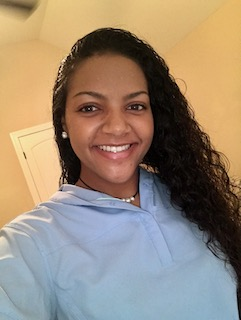

<link rel="stylesheet" href="style.css">

  
  <h1>Delilah Slabaugh</h1>
  <h3>Data Science Student | Problem Solver | Lifelong Learner</h3>

---

## Welcome

Welcome to my portfolio — a place to explore my work, skills, and journey in data science. This site highlights my projects, technical background, and ways to connect with me.

---

## About Me

I’m a Bachelor of Science student majoring in Data Science (graduating August 2025) with a foundation in industrial systems, IT, and programming. I enjoy using data to solve real-world problems and tell meaningful stories through insights and visualizations.

My toolkit includes:
- Python & R
- SQL (PostgreSQL, SQLite)
- Tableau, Matplotlib
- pandas, NumPy, scikit-learn, seaborn

---

## Projects

Here’s a snapshot of my projects — full write-ups coming soon:
- **[Analyzing Climate Trends with NASA Data](projects/nasa-climate.md)**
- **[Sentiment Analysis on Movie Reviews](projects/movie-sentiment.md)**
- **[Predicting Patient Readmission Risk](projects/readmission-risk.md)**

---

## Website

[Visit my site](https://dnsla.github.io/portfolio)

---

## Contact

I’d love to connect!
- 📞 (832) 515-8269
- 📧 binkleyd@icloud.com
- 💻 [GitHub @dnsla](https://github.com/dnsla)

---

  
This portfolio is always growing — check back for updates and new work!

